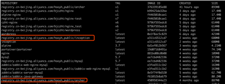
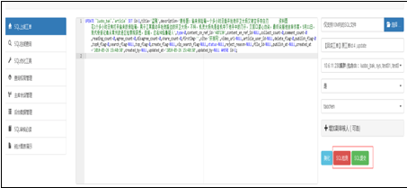

一、简述信息
---
*	体验地址：http://192.168.1.48:9123/
*	用户信息

角色|账号|密码
:---:|:---:|:---:
管理员|admin|admin
工程师|engineer|archer
审核人|auditor|archer
DBA|dba|auditor

*   docker 地址分别如下
```
	registry.cn-beijing.aliyuncs.com/hooyh_public/inception
	registry.cn-beijing.aliyuncs.com/hooyh_public/archer
```
二、安装docker以及启动inception、MySQL和archer
---
1. 安装
```
yum install -y yum-utils device-mapper-persistent-data lvm2
yum-config-manager --add-repo http://mirrors.aliyun.com/docker-ce/linux/centos/docker-ce.repo
yum makecache fast
yum -y install docker-ce
service docker start

```
2. pull所需镜像
```
docker pull registry.cn-beijing.aliyuncs.com/hooyh_public/archer
docker pull registry.cn-beijing.aliyuncs.com/hooyh_public/inception
```
下载完之后docker images查看镜像



3. 创建配置文件/etc/inc.cnf
```
cat >>/etc/inc.cnf<<EOF
[inception]
general_log=1
general_log_file=inception.log
port=6669
socket=/tmp/inc.socket
character-set-client-handshake=0
character-set-server=utf8
#备份库信息
inception_remote_system_password=123456
inception_remote_system_user=root
inception_remote_backup_port=3306
inception_remote_backup_host=mysql
inception_support_charset=utf8,utf8mb4
inception_enable_nullable=0
inception_check_primary_key=1
inception_check_column_comment=1
inception_check_table_comment=1
inception_osc_on=OFF
inception_osc_bin_dir=/usr/bin
inception_osc_min_table_size=1
inception_osc_chunk_time=0.1
inception_enable_blob_type=1
inception_check_column_default_value=1
EOF
```
4. 启动inception

指定配置文件和端口
```
docker run --name inception -v ~/data/inception/inc.cnf:/etc/inc.cnf -p 6669:6669 -dti registry.cn-beijing.aliyuncs.com/hooyh_public/inception
```
5. 启动MySQL5.7镜像
```
docker run -d --name mysql   -p 3306:3306 -v ~/data/mysql:/var/lib/mysql:rw  -e MYSQL_ROOT_PASSWORD=123456 -d mysql:5.7.22
```
6. 配置archer

安装完毕之后  创建django初始化的settings.py
红色标注为需要根据自身服务器修改的地方   如果出现报错 注意配置中间是否有多余空行

[settings.py](https://gitlab.com/xmcar/opt/optdoc/raw/48ed9e0282c9432bace67f3a2145d30eb6743447/IT运维文档/平台工具类/MySQL自动化运维/settings.py)

7. 创建一个archer_github数据库

我用的编码格式为 utf8mb4_bin
```
CREATE DATABASE `archer_github` DEFAULT CHARACTER SET utf8mb4 COLLATE utf8mb4_bin;
```


不创建数据库初始化会报如下错误


在mysql中执行如下sql否则回滚sql时 会提示inception账号的一系列问题哦
```
grant all privileges on *.* to 'inception'@'%' identified by 'inception' with grant option;
flush privileges;
```


创建完数据库之后运行容器
```
docker run --name archer -e NGINX_PORT=9123 -p 9123:9123 --link mysql:mysql --link inception:inception -dti registry.cn-beijing.aliyuncs.com/hooyh_public /archer
```
8. 进入archer容器执行初始化命令
```
docker exec -ti archer /bin/bash
cd /opt/archer
source /opt/venv4archer/bin/activate
```
修改 archer/settings.py修改其中数据库的地址及账号密码否则makemigrations会报错


```
python3 manage.py makemigrations sql
```

```
python3 manage.py migrate
```


创建管理员账号
```
python3 manage.py createsuperuser
admin
```
创建完毕后，退出并重启该archer容器，让其用户生效
 查看容器状态


9. 关闭防火墙或添加防火墙规则访问
```
http://127.0.0.1:9123
```
三 、登录系统配置及验证
---
1. 发布sql工单流程

普通用户登录http://127.0.0.1:9123


输入你要执行的sql


审批人账号收到邮件


用审批人账号登录


审核通过


DBA账号收到邮件

用DBA账号登录

执行


回滚同理


2. 配置阿里云RDS

如果需要加入阿里云RDS修改配置文件settings.py


也可以加上邮件通知


重启archer 的docker服务 就可以了


3. 测试回滚功能


审核并执行


执行成功


查看数据库中备份


提交回滚请求 需要检测之后提交




切换dba账户执行回滚


回滚成功


邮件也收到，只不过我为了测试邮件通知人都是自己

需要修改的话直接在后台数据管理中修改


4. 数据库名称

如果数据库名太长的话 会报错
```
Global environment  error
The backup dbname 'rm-bp1570xxxfo.mysql.rds.aliyuncs.com-3306- lse_home_prod ' is too long.
```


原因是RDS库名+端口+数据库名太长，超过了mysql 的information_schema中字段的值64

所以库名不要超过11字节就不会报上述错误了(sql错误请忽略我就是拿来演示的)


要不就ping一下阿里云的RDS地址  把RDS地址换成ip即可

在工单界面 也是看不到具体ip的


5.配置访问地址为80访问

6.再安装一个80端口的nginx  解析到docker的9123的nginx 端口

7.只需要添加下面一条设置即可


8.防火墙配置

把9123 80 3306 6669端口加入防火墙  并reload
```
firewall-cmd --zone=public --add-port=80/tcp --permanent
firewall-cmd --zone=public --add-port=9123/tcp --permanent
firewall-cmd --zone=public --add-port=3306/tcp --permanent
firewall-cmd --zone=public --add-port=6669/tcp --permanent
firewall-cmd --reload
```
如果你的sql 比较大，可能会报错


修改archer 容器里nginx配置中client_max_body_size 设置大一点就可以了


9. 配置LDAP

加入ldap    由于之前搭建的服务器是没有介入内网ldap的  配置ldap的时候就一模一样再装了一遍

ldap配置可参考[https://www.cnblogs.com/chenminklutz/p/9642277.html](https://www.cnblogs.com/chenminklutz/p/9642277.html)     
不过我的ou带有空格 cn带有空格所以自己重新配置了用“”把字段括起来了
红色框框处需要自行根据ou进行修改


可以先安装ldapsearch测试
```
yum install -y openldap-servers openldap-clients migrationtools
ldapsearch -x -W -h  172.16.5.1 -p 389 -b "dc=tiansoft,dc=com" -D "cn=Jiamin Xu(Hugo),ou=FTE,ou=Domain Users,dc=tiansoft,dc=com"
```


至此mysql自动化运维平台已经搭建完毕  配置方面请根据个人需求配置。
