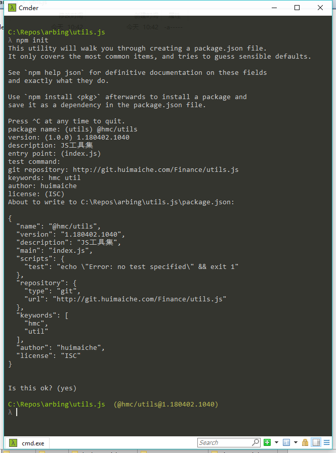

# NPM 包管理

## 新建

使用命令 `npm init` 初始化。



按照提示输入相应信息。

`name` ：包名，添加 `Group` 前缀 `@hmc/` ，防止冲突。

`version` ：版本号，格式如 `1.180402.1039`，三段分别为主版本号、当前年月日、当前时间。发布前，注意更新版本号，相同版本号不能重复发布。

`description` ：描述。

`main` ：入口文件，一般是 `index.js`，包要暴露的接口从这个文件用 `export` 导出。

`keywords` ：关键字，用于检索。

## 发布

项目文件 `package.json` 添加私服发布配置节点。

```json
"publishConfig": {
  "registry": "http://nexus.huimaiche.com/repository/npm-hosted/"
}
```

> 发布前，注意更新版本号，相同版本号不能重复发布。

### `gitlab-ci` 发布

文件 `.gitlab-ci.yml` 配置发布 Job。

```yaml
stages:
  - build
  - publish

before_script:
  - |
    chcp 65001
  - |
    set RepoDir= %cd%

publish:
  stage: publish
  script:
    - |
      echo "publish..."
    - |
      npm publish
  only:
    - master
  when:  manual
```

需要发布时，从 gitlab 的 Pipelines 页面手动运行 `publish` Job。

### 手动发布

命令行运行，登录私服。

```bash
npm login --registry=http://nexus.huimaiche.com/repository/npm-hosted/
```

项目目录下运行命令，发布到私服。

```bash
npm publish
```

## 删除

如果有误上传的包，可以登录 `nexus` 删除。

Url：http://nexus.huimaiche.com/#browse/browse:npm-hosted

用户名：hmc_npm

密码：hmc4npm

找到要删除的包和版本，点击右边的 `Delete component` 按钮删除。

## 使用

浏览所有私有包：http://nexus.huimaiche.com/#browse/browse:npm-hosted

检索包：http://nexus.huimaiche.com/#browse/search

项目目录下运行命令，安装最新版包到项目中。

```bash
yarn add @hmc/utils
```

项目中导入接口使用。

```js
import utils from '@hmc/utils'

utils.validates.vinValidate()
```
